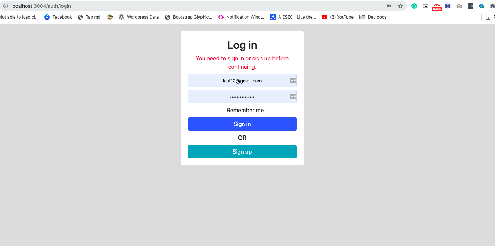
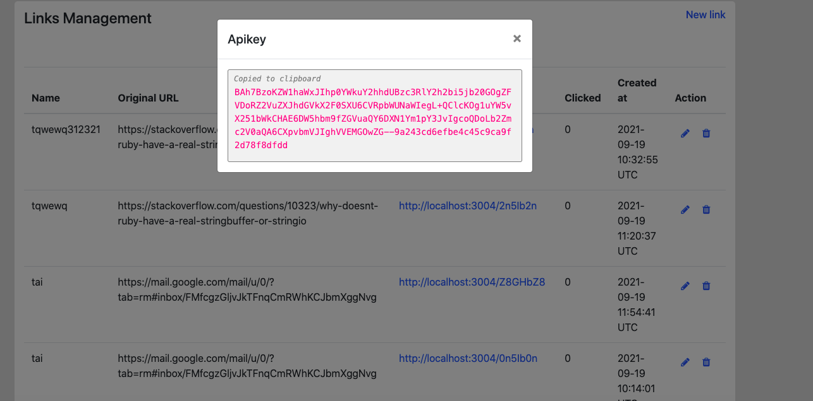
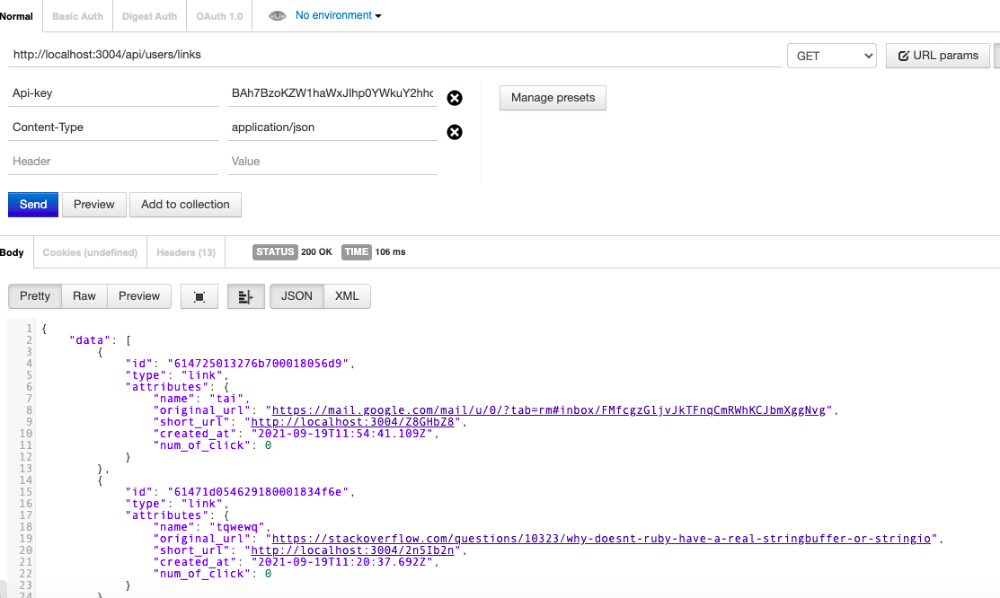
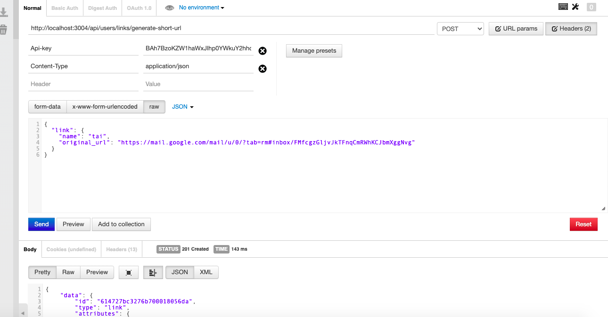

## What I did do
I finished to create the app for short URL with base 62 and rails.

The APIs **get the user's links** and  **create short URL** by Api key works well.

The code is covered by testing (Only Service and routes).

## How to start
 1. Clone source and run ``docker-compose up`` in terminal (don't forget install Docker)
 2. Go to link http://localhost:3004 to check web started (change port in ``docker-compose.yml``)
 3. Run create Mongodb indexes and shard key by the commands 
 - ``docker-compose run --rm app bundle exec rake db:mongoid:create_indexes``
 - ``docker-compose run --rm app bundle exec rake db:mongoid:shard_collections``

**Note**: If you want to config domain like in ``docker-compose.yml``, you need to setup the Traefik (You can try it with my [Traefik](https://github.com/taigroddy/docker-environment)).

## How to use the APIs
2 APIs is ready for now:

``GET /api/users/links``

``POST /api/users/links/generate-short-url``

You need to create a account in UI and login to get Api key (Api-key). Then, you can send the request with header like this

``
Api-key: BAh7BzoKZW1haWxJIhp0YWkuY2hhdUBzc3RlY2h2bi5jb20GOgZFVDoRZ2VuZXJhdGVkX2F0SXU6CVRpbWUNaWIegL+QClcKOg1uYW5vX251bWkCHAE6DW5hbm9fZGVuaQY6DXN1Ym1pY3JvIgcoQDoLb2Zmc2V0aQA6CXpvbmVJIghVVEMGOwZG--9a243cd6efbe4c45c9ca9f2d78f8dfdd
``

## What need to improve
 - UI responsive
 
## Screenshot

